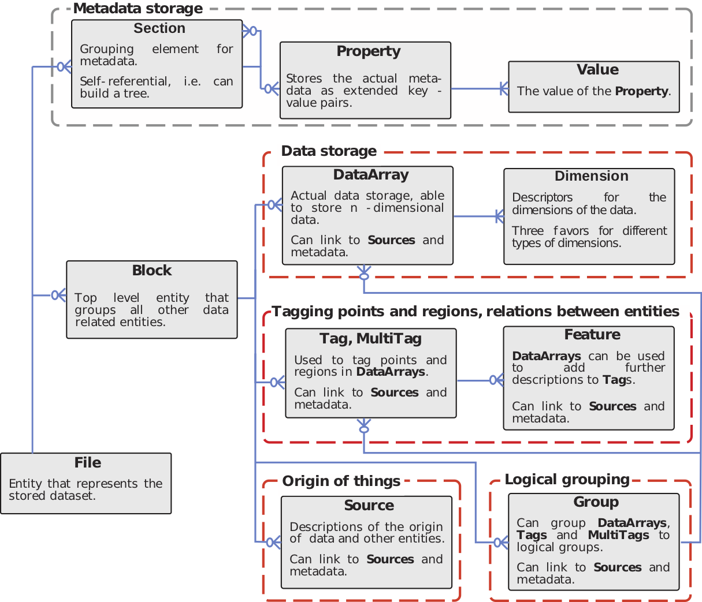

*NIX* data model
================

The entity-relation schema below shows all entities that are defined in
the *NIX* data model. To illustrate relations between the entities we
use the crow-foot notation: **foo –0< bar** indicates that *foo* can
contain zero to many *bar* objects. **foo –|< bar** denotes that there
has to be at least one object of the *bar* type.

   er-schema

The figure shows the purpose of the different entities but not their
fields. For this, refer to the API documentation, the
`wiki <https://github.com/G-Node/nix/wiki>`__ and the tutorials.

`home <./index.md>`__ – `back <./getting_started.md>`__
