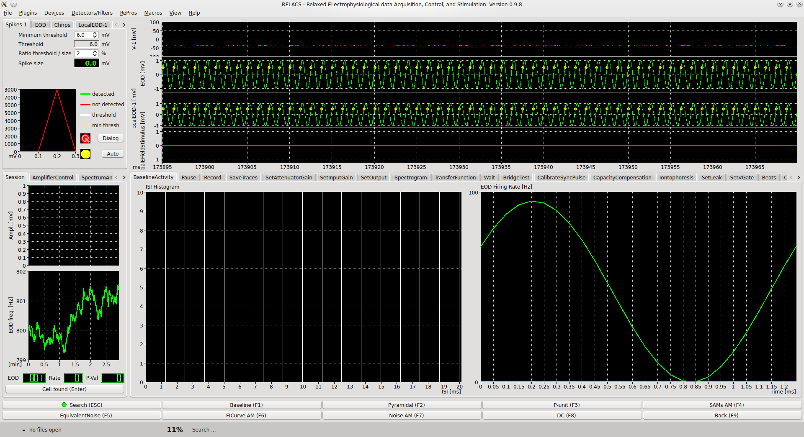

.. toctree::
   :maxdepth: 1


Integration into relacs
=======================

.. |tux| image:: ./images/relacstux.png
   :width: 100px

|tux| `Relacs <relacs.net>`__ is a highly configurable  recording tool for
electrophysiology.

It is one use-case showing how to integrate automated data storage and
data annotation into the recording process.

Relacs overview
---------------

In the `Neuroethology group <www.neuroetho.uni-tuebingen.de>`__ relacs
is used to record the activity of single neurons during
electrophysiological experiments. It controls the experiment, presents
stimuli, does some online analysis and stores the data to disk. It
knows a lot of metadata that are essential to correclty analyze the
data and adapts stimuli in a closed loop fashion. Accordingly, it
requires a lot of flexibility and the configurability leads to the
situation that options and settings are to some extent not
foreseeable.



   **Figure 1:** The relacs user interface. The ui is divided into four panels. Top
   left: Filter and detector plugins that are used to detect events in
   the recorded data (such as action-potentials, spikes). Top right:
   Main panel showing the four recorded traces (membrane potential,
   fish's electric organ discharge global, same at a reference
   location, the stimulus applied during the experiment) yellow dots
   indicate detected events. Bottom left: diverse control panels, or
   other displays. Bottom right: Space the currently active research
   protocol (RePro) can use to display data or interact with the
   experimenter.

Several traces are recorded in parallel (usually sampled with 20, 40,
or 100 kHz per channel 16 bit, depending on experimental requirements).

1. The neuron's membrane voltage (V-1).
2. The fish's electric organ discharge (EOD), global measurement.
3. The local measurement of the EOD (LocalEOD-1).
4. The stimulus put into the tank (GlobalEFieldStimulus).
5. The times of detected spikes (Spikes-1).
6. Sometimes the times of EOD discharges and detected chirps
   (communication signals).


Metadata
--------

Relacs knows a lot of metadata that are either configured before the
experiment was started (for example the parameters used when measuring
a firing rate vs intensity curve, the left figure below), are
automatically adapted, or have to be entered by the user when storing
the data (right figure below) or are derived from the recorded data
(average firing rate, the EOD frequency, etc).

.. |options| image:: ./images/relacs_ephys_options.png
   :width: 100 %

.. |dialog| image:: ./images/relacs_ephys_mdata.png
   :width: 100 %

+--------------+--------------+
| **Figure 2** | **Figure 3** |
+--------------+--------------+
| |options|    |     |dialog| |
+--------------+--------------+


A recording session
-------------------

Once the recording of a neuron has been established and we are ready
to start running the actual experiment.  Either pre-defined macros are
used to control the experiments or the experimenter starts research
protocols (RePros) manually.

When recording the data time is not necessarily real time. That is,
the data is only recorded when an active research protocol (RePro)
sets the acquisition active and thus the data time is only runs when
the acquisition is active. The figure below illustrates this.


   **Figure 4:** A recording session becomes active once the acquisition is switched
   on (red bar). Data acquisition, however, data is stored in the NIX
   file, when the currently running RePros demands it. In this example
   session there are two RePros active, the so called "Baseline"
   (green) and the "fi-curve" (blue). Within the time the fi-curve
   RePro is active three stimuli are presented (light blue). For each
   stimulus presentation the fi-curve RePro applies a stimulus with a
   different intensity (contrast, blue numbers).

Representation in NIX
---------------------

So much for the background. In the following we will illustrate how
such data is persisted in NIX files and how to work with the
data. Since relacs is programmed in C++ the *nixio* c++ library is
used for this. The code below uses the python implementation *nixpy*.

.. figure:: ./images/relacs_tagging.png
   :alt: tagging repros and stimuli
   :align: left
   :figwidth: 100 %

   **Figure 5:** All four recorded traces and all event traces (only
   the spike events are shown here) are stored in
   ``nix::DataArrays``. Whenever a RePro is active a ``nix::Tag`` is
   created that stores the start time and temporal extent (in data
   time, see above) and links to metadata ``nix::Section`` that stores
   the static RePro parameters, i.e. those that do not change during
   this RePro run. A RePro may apply certain stimuli (the fi-curve
   RePro) and these stimulus times and extents are stored in a
   ``nix::MultiTag`` entity. It further links to some more metadata
   entries. Some paramters, in this case the stimulus "contrast"
   changes with each stimulus presentation. This information is not
   stored in the metadata but is considered a *feature* of the
   stimulus presentation. That is, we create a ``nix::DataArray`` to
   store these numbers, one for each stimulus presentation, and link
   it to the ``nix::MultiTag`` as an **indexed** ``nix::Feature`` (see
   `adding features <tagging.html#adding-features>`__ for details).


Storing of continuously sampled data
````````````````````````````````````

The continuous traces in **figure 5** are continuously sampled 1-D
vectors. This only dimension represents time, the measured values
themselves are double values. In NIX data is stored in
``nix::DataArray`` entities. The regular sampling of the time
dimension is defined using a ``nix::SampledDimension`` (see `storing
data <storing_data.html>`__ for more information). Since the duration
of the recording is unknown the data is continously written to file.

The following code block illustrates the basic steps (the full
implementation can be found `here
<https://github.com/relacs/relacs/blob/master/relacs/src/savefiles.cc>`__
):

.. code-block:: c++
   :linenos:
   :caption: Initialization of the continuously sampled input traces

   void SaveFiles::NixFile::initTraces ( const InList &IL )
   {
      for ( int k=0; k<IL.size(); k++ ) {
         NixTrace trace;
         string data_type = "nix.data.sampled." + IL[k].ident();
         trace.data = root_block.createDataArray(IL[k].ident(), data_type, nix::DataType::Float, {4096});
         std::string unit = IL[k].unit();
         nix::util::unitSanitizer(unit);
         if ( !unit.empty() && nix::util::isSIUnit(unit) ) {
             trace.data.unit( unit );
         } else if ( !unit.empty() ) {
             std::cerr << "NIX output Warning: Given unit " << unit << " is no valid SI unit, not saving it!" << std::endl;
         }
         if ( !IL[k].ident().empty() )
             trace.data.label(IL[k].ident() );
         nix::SampledDimension dim;
         dim = trace.data.appendSampledDimension(IL[k].sampleInterval());
         dim.unit("s");
         dim.label("time");
         trace.index = IL[k].size();
         trace.written = 0;
         trace.offset = {0};
         traces.push_back(std::move(trace));
      }
   }

In this code snippet ``IL`` is a vector of ``relacs::InData``
objects. These provide some information about the data coming in.
**Line 4:** for each ``k``th element of the InputList, a ``NixTrace``
object is created that merely buffers the entity for later re-use.
**Line 6:** a ``nix::DataArray`` is initialized with a name, a type
(line2), the data type and an initial size. Selecting this intial size
defines the chunksize applied by the underlying HDF5
library. Selecting a too small chunk size will cause performance
problems. **Lines 16--19** set the dimension information
(``nix::SampledDimension``).
At this point, no data has been written to file.

Writing actually happens in a small helper function that works with
the NixTrace object created before:

.. code-block:: c++
   :linenos:
   :caption: Writing chunks of data to disk once they become available.

   void SaveFiles::NixFile::writeChunk( NixTrace &trace, size_t to_read, const void *data )
   {
      typedef nix::NDSize::value_type value_type;
      nix::NDSize count = { static_cast<value_type>(to_read) };
      nix::NDSize size = trace.offset + count;
      trace.data.dataExtent( size );
      trace.data.setData( nix::DataType::Float, data, count, trace.offset );
      trace.index += to_read;
      trace.written += to_read;
      trace.offset = size;
   }


Storing of event data
`````````````````````

Neuronal event such as action potentials are stored in
``nix::DataArrays``. Again, the data is basically a 1-D vector in
which the one dimension represents time. We store event times and the
events may come at any time.

.. code-block:: c++
   :linenos:
   :caption: Creating ``nix::DataArrays`` for events.

   void SaveFiles::NixFile::initEvents( const EventList &EL, FilterDetectors *FD ) {
      for ( int i = 0; i < EL.size(); i++ ) {
         if ( (EL[i].mode() & SaveTrace) == 0 ) {
             continue;      //Nothing to save
         }
         NixEventData ed;
         ed.el_index = i;
         ed.index = EL[i].size();
         ed.offset = {0};
         std::string ident = EL[i].ident();
         std::string data_type = "nix.events.position." + ident;
         if ( root_block.hasDataArray(ident) )
             ident = EL[i].ident() + "_events";
         ed.data = root_block.createDataArray( ident, data_type, nix::DataType::Double, {256} );
         ed.data.unit( "s" );
         ed.data.label( "time" );
         ed.data.appendAliasRangeDimension();
         ed.input_trace =  FD->eventInputTrace( i );
         events.push_back(std::move(ed));
      }
   }

This is very similar to the ``initTaces`` above. Two things are wroth
mentioning. **Line 14:** The initial size was chose much smaller, we
expect less event than data points in the traces. **Line 17:** The
values stored in the ``nix::DataArray`` are times, (int *data time*,
see above). Thus, we apply an ``nix::AliasRangeDimension`` which
indicates that the values themselves define the dimension.


Defining stimulus segments ``````````````````````````


Working with relacs-flavored NIX files
--------------------------------------
