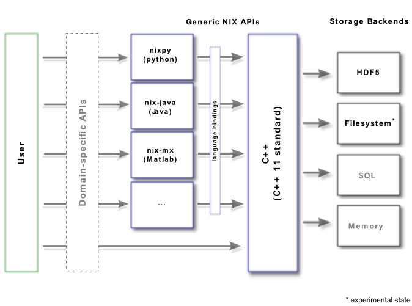

.. toctree::
   :maxdepth: 1

Support for standardization
===========================

Having a well-defined and open data format for storing a vast diversity
of scientific data in itself is a cool thing. In an optimal world, and
if the data format would be perfect, tools designed for such a generic
data model could be used without any other knowledge to, at least, get
some basic insights into the data.

One real-world issue is that different (scientific) communities use
similar terms to describe (slightly) different things. A very simple
example would be the temperature. Large parts of the world would
immediately understand a temperature value in terms of degrees Celsius.
Other parts of the world prefer Fahrenheit while parts of the scientific
world would certainly go for Kelvin.

In other words, at some point we need to agree on definitions. Or, we
need to be able to specify which definitions are used.

Standardization of metadata
---------------------------

The metadata part of the *NIX* data model is basically the
`odml <https://github.com/g-node/python-odml>`__ data model and
implements the standardization methods used in the odml-libraries. That
is, it is possible to use specifications made in so called terminologies
(collections of names and definitions of sections and properties). In
odml, several of such
`terminologies <https://portal.g-node.org/odml/terminologies/v1.0/terminologies.xml>`__
have been suggested.

Standardization of data
-----------------------

In *NIX* almost all entities have a **type** field which can be used to
indicate the applied definition. In our example code within this
documentation, we used very unspecific types like *nix.demo*,
*nix.sampled*, or *nix.stimulus_segment*. The **type** is intended to be
used as a namespace in a *hierarchical* fashion. Hierarchical levels are
separated by dots. For example *nix.sampled* could indicate that the
entity contains data that is stored according to the “nix” definitions
and is regularly sampled in one dimension. A tool, that knows about such
types, could select the appropriate measures to display the data.

Domain-specific high-level APIs
-------------------------------

So far, the *NIX* project is mainly concerned about the technical side
and not so much about the definition of terms and types. That is, we
provide the low-level APIs to read and write the data. All other
responsibilities are left to the user. The figure below shows the
relations between the different *NIX* libraries and how we envision
future development towards domain-specificity.

The *NIX* ecosystem so far consists of the generic
`C++ <https://github.com/g-node/nix>`__ and
`python <https://github.com/g-node/nixpy>`__ libraries that directly
write to the storage backend (only HDF5 is fully supported at the
moment). Further, we provide language bindings for
`java <https://github.com/g-node/nix-java>`__ and
`Matlab <https://github.com/g-node/nix-mx>`__ that work via the C++
library. In our vision, domain-specific APIs will be developed that use
the generic entities and wrap them in the terms that are used in a given
community. A first step into this direction is the nix storage backend
in `*NEO* <http://neuralensemble.org>`__ that exposes *NIX* constructs
as *NEO* entities.
