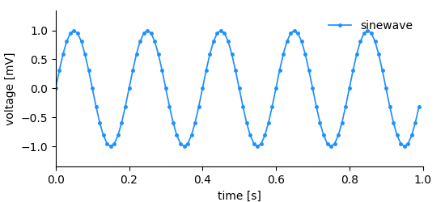

# Storing data

1. We want to be able to store **n-dimensional** data structures.
2. The data structures must be **self-explanatory**, that is, it must
  contain sufficient information to draw a basic plot of the data.


Considering the simple plot above, we can list all information that it
shows, or, the other way round, that needs to be stored.

* the data (voltage measurements)
* the y-axis labeling, i.e. label (voltage) and unit (mV)
* the x-axis labeling, i.e. label (time) and unit (s)
* the x-position for each data point
* a title/legend

In this, and in most cases, it would be inefficient to store x-, and
y-position for each data point. The voltage measurements have been
done in regular (time) intervals. Thus, we rather need to store the
measured values and a definition of the x-axis consisting of an offset,
the sampling interval, a label, and a unit.

This is exactly the approach chosen in *NIX*. For each dimension of the
data a **dimension descriptor** must be given. In *NIX* we define three
(and a half) dimension descriptors:

1. *SampledDimension*: Used if a dimension is sampled in regular intervals.
2. *RangeDimension*: Used if a dimension is sampled in irregular
   intervals. There is a special case of the *RangeDimension*, the
   *AliasRangeDimension*, which is used when e.g. event times are
   stored.
3. *SetDimension*: Used for dimensions that represent categories
   rather than physical quantities.


## The DataArray

The *DataArray* is the most central entity of the *NIX* data model. As
almost all other *NIX*-entities it requires a *name* and a
*type*. Both are not restricted but names must be **unique** inside a
*Block*. *type* information can be used to introduce semantic meaning
and domain-specificity. Upon creation, a unique ID will be assigned to
the *DataArray*.  have a unique ID.

The *DataArray* stores the actual data together with label and
unit. In addition, the *DataArray* needs a dimension descriptor for
each dimension. The following snippet shows how to create
a *DataArray* and store data in it.

```c++
#include <nix.hpp>
#include <numeric>

int main() {
    // create some dummy data
    std::vector<double> time(1000);
    std::vector<double> voltage;
    double interval = 0.01;
    double pi = 3.1415;
    double freq = 1.5;
    std::iota(time.begin(), time.end(), 0.);
    std::transform(time.begin(), tims.end(), time.begin(),
                   [interval](double t){ return t * interval; })
    std::transform(time.begin(), time.end(), std::back_inserter(voltage),
                   [pi, freq](double t) { return std::sin(t * freq * 2 * pi); });

    // open a file, create a block that will host the data
    nix::File f = nix::File::open("test.nix", nix::FileMode::Overwrite, "hdf5",
                                  nix::Compression::DeflateNormal);
    nix::Block b = f.createBlock("demo block", "demo");

    // create a DataArray
    nix::DataArray array = b.createDataArray("sinewave", "nix.sampled", voltage);
    array.label("voltage");
    array.unit("mV");

    nix::SampledDimension dim = array.appendSampledDimension(interval);
    dim.label("time");
    dim.unit("s");

    f.close();
    return 0;
}
```

In the example shown above, the *NIX* library will figure out the
dimensionality of the data, the shape of the data and its type. The
data type and the dimensionality are fixed once the *DataArray* has
been created. The actual size of the *DataArray* can be changed,
altered during the life-time of the entity.

In case you need more control, *DataArrays* can be created empty for
later filling e.g. during data acquisition.

```c++
nix::DataArray array = block.createDataArray("sinewave", "nix.sampled", nix::DataType::Double, {100});
```

The resulting *DataArray* will have an initial size (100 elements)
which will be automatically resized, if required. The data type is set
to double. The *NIX* library will further try to convert passed data
to the defined data type, if possible.

Data can be set with a call like this:
``array.setData(voltage);``

Writing/Replacing subsets can be done by providing the *count* and the
*offset* of the data chunk.


# Dimensions

Within the *DataArray* we can store n-dimensional data. For each
dimension we must provide an **dimension descriptor*. The following
introduces the individual descriptors.

## SampledDimension


The same situation as before, the data has been sampled in regular
intervals. That is, the time between successive data points is always
the same. The x-axis can be fully described with just a few parameters:

1. sampling interval
2. offset
3. label
4. unit

The *SampledDimension* entity is used in such situations and needs to
be added to the *DataArray* entity upon creation:

```c++
nix::DataArray array = block.createDataArray("name", "nix.sampled", voltage);
array.label("voltage");
array.unit("mV");

nix::SampledDimension dim = array.appendSampledDimension(sampling_interval);
dim.label("time");
dim.unit("s");
dim.offset(0.0);   // not needed, it is 0.0 by default
```

**Why sampling interval, not sampling rate?** Because the interval is
the more **general** term, it can also be applied to dimensions that
do not extend in time but, for example space.


## RangeDimension


Similar situation as before, but this time the temporal distance
between the sampled voltages is not regular. Storing this kind of data
is not as efficient as in the regularly sampled case. The following
information needs to be stored to describe the dimension:

1. x-positions of the data points, i.e. *ticks*
2. label
3. unit

In this kind of dimension we store a *range* of ticks, therefore the
name *RangeDimension*. It needs to be added to the *DataArray*
when it is created.

```c++
std::vector<double> ticks = {1.2, 2.7, 3.4, 4.0, 5.1};
nix::DataArray array = block.createDataArray("name", "nix.irregular_sampled", voltages);
array.label("voltage");
array.unit("mV");

nix::RangeDimension dim = array.appendRangeDimension(ticks);
dim.label("time");
dim.unit("s");
```

The *ticks* of a *RangeDimension* must be numeric and ascending.


### AliasRangeDimension

A special case of a *RangeDimension* that is used when storing
something equivalent to event times.


In the plot above, each dot marks the occurrence of an event. In such
a case it is basically the x-values that are of interest. It would be
most inefficient to store them twice, first as values in the *DataArray*
and then again as ticks in the dimension descriptor.

The *AliasRangeDimension* is used in such situations. Internally, it is
a *RangeDimension* whose information is tied to the information stored
in the *DataArray* itself. Changing the ticks, label or unit on the
dimension descriptor will change the *DataArray* itself. Adding an
*AliasRangeDimension* is straight forward:

```c++
nix::DataArray array = block.createDataArray("events", "nix.irregular_sampled", event_times);
array.label("time");
array.unit("s");

nix::RangeDimension dim = array.appendAliasRangeDimension();
```

**Note!** An *AliasRangeDimension* is only permitted, if the data is
1-D and the values are numeric, an exception will be thrown otherwise.


## SetDimension


If we need to store data that falls into categories, i.e. the
x-positions are not numeric or the dimension does not have a natural
order, a *SetDimension* is used. It  stores a label for each
entry along the described dimension.

```c++
std::vector<std::string> labels = {"A", "B", "C", "D", "E"};

nix::DataArray array = block.createDataArray("temperatures", "nix.categorical", temperatures);
array.label("temperature");
array.unit("K")

SetDimension dim = array.appendSetDimension();
dim.labels(labels);
```


[home](./index.md "nix github.io home") -- [back](./getting_started.md "Getting started")
