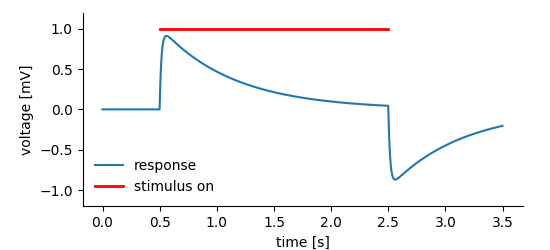
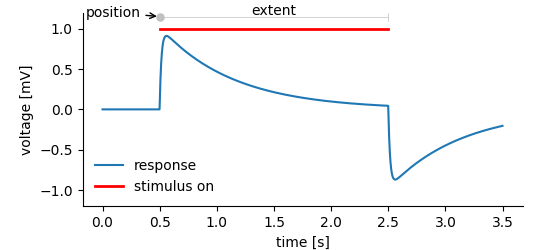

# Tagging Points and regions in recorded data

The **DataArray**s store data, but this is not all that is needed to
store scientific data. Suppose, we are recording the response of a
system to a certain stimulus.



We may want to store:

1. The recorded system's response before, during, and after the stimulus.
2. The time, the stimulus was on.

In the *NIX* data model **Tag** entities are used to tag regions in a
**DataArray**. For this the **Tag** stores the **position** and the
**extent** of the highlighted segment.



```c++
some code
```
