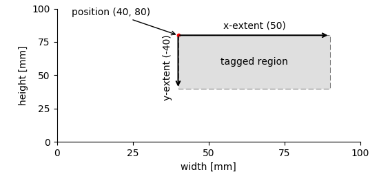

# Tagging points and regions

The *DataArray*s store data, but this is not all that is needed to
store scientific data. We may want to highlight points or regions in
the data and link it to further information.

This is done using the *Tag* and the *MultiTag* for tagging single or
mutliple points or regions, respectively.


## Single points/regions

### Tagging in 1D

Suppose, we are recording the response of a system to a certain
stimulus.


We may want to store:

1. The recorded system's response before, during, and after the stimulus.
2. The time, the stimulus was on.

In the *NIX* data model *Tag* entities are used to tag regions in a
*DataArray*. For this the *Tag* refers to the *DataArray* and
stores **position** and **extent** of the highlighted segment.


```c++
#include <nix.hpp>
#include <numeric>

int main() {
    double interval = 0.01;
    double stim_on = 0.5;
    double stim_off = 2.5;
    std::vector<double> response(350);
    std::iota(response.begin(), response.end(), 0.);
    std::transform(response.begin(), response.end(), response.begin(),
                   [interval](double x){ return x * interval; });
    std::transform(response.begin(), response.end(), response.begin(),
                   [stim_on, stim_off](double x){ return (x >= stim_on && x < stim_off) ? 1 : 0; });

    nix::File f = nix::File::open("tagging1.nix", nix::FileMode::Overwrite);
    nix::Block block = f.createBlock("demo block", "nix.demo");

    nix::DataArray data = block.createDataArray("response", "nix.sampled", response);
    data.label("voltage");
    data.unit("mV");

    nix::SampledDimension dim = data.appendSampledDimension(interval);
    dim.label("time");
    dim.unit("s");

    nix::Tag stim_tag = block.createTag("Stimulus", "nix.stimulus_segment", {stim_on});
    stim_tag.extent({stim_off - stim_on});
    stim_tag.addReference(data);

    return 0;
}
```

**Note!** Position and extent of the tagged region are given as
``std::vector``. Extent is optional, not setting it tags a point not
a segment of the referenced data.


#### Handling of units
In the above example we do not explicitly specify a unit for position
and extent. They are implicitly assumed to be given in the same unit
as the *DataArray*. It is, however, possible to specify a unit (or
rather a unit for each dimension), if this is more convenient. For
example, it would be possible to give position and extent in *ms*. The
*NIX* does not validate at this point. It is user responsibility that
units match. In order to work smoothly, it is best to use only SI
units and compounds of these.

```c++
    nix::Tag stim_tag = block.createTag("Stimulus", "nix.stimulus_segment", {stim_on});
    stim_tag.extent({stim_off - stim_on});
    stim_tag.units({"ms"});
```

### Tagging in 2D

The same principle shown above for 1-D data extends to two or more
dimensions. The only difference is that one has to provide vectors of
positions/extents that match in length to the number of dimensions of
the referenced *DataArray*.



```c++
#include <nix.hpp>
#include <nix/hydra/multiArray.hpp>

int main() {
    // create 2D dummy data
    typedef boost::multi_array<double, 2> array_type;
    typedef array_type::index index;
    array_type data(boost::extents[100][100]);

    int values = 0;
    for(index i = 0; i < 100; ++i)
        for(index j = 0; j < 100; ++j)
            data[i][j] = values++;

    // create a new file, enable compression
    nix::File f = nix::File::open("2_d_tag.nix", nix::FileMode::Overwrite, "hdf5", nix::Compression::DeflateNormal);
    nix::Block b = f.createBlock("demo block", "nix.demo");

    nix::DataArray array = b.createDataArray("2D data", "nix.sampled.2d", data);
    array.label("fantastic ints")
    // add descriptor for x-, and y axes
    SampledDimension dim = array.appendSampledDimension(1.);
    dim.label("width");
    dim.unit("mm");

    dim = array.appendSampledDimension(1.);
    dim.label("height");
    dim.unit("mm");

    nix::Tag tag = b.createTag("tagged region", "nix.region", {40., 80.});
    tag.extent({50., -40.});
    tag.addReference(array);
    return 0;
}
```

## Multiple points/regions

### Tagging multiple points in 1D

Consider the following situation: A signal has been recorded and
within this signal, certain events have been detected (figure below).


For storing this kind of data we need two *DataArrays*, the first
stores the recorded signal, the other the events. Finally, a
*MultiTag* entity is used to link both. One can use the event times
stored in one of the *DataArrays* to tag multiple points in the
signal.

```c++
#include <nix.hpp>
#include <numeric>

int main() {
    // create dummy data
    std::vector<double> time(1000);
    std::vector<double> voltage;
    std::vector<double> threshold_crossings;
    double threshold = 0.5;
    double interval = 0.001;
    double pi = 3.1415;
    double freq = 5.;

    std::iota(time.begin(), time.end(), 0.);
    std::transform(time.begin(), time.end(), time.begin(),
                   [interval](double t){ return t * interval; });
    std::transform(time.begin(), time.end(), std::back_inserter(voltage),
                   [pi, freq](double t){ return std::sin(t * freq * 2 * pi) + std::sin(t * freq * 4 * pi) * 0.4; });
    for (size_t i = 0; i < voltage.size() - 1; ++i) {
        if (voltage[i] <= threshold && voltage[i+1] > threshold) {
            threshold_crossings.push_back(time[i]);
        }
    }

    // open a file, create a block that will host the data
    nix::File f = nix::File::open("mtag_test.nix", nix::FileMode::Overwrite, "hdf5",
                                  nix::Compression::DeflateNormal);
    nix::Block b = f.createBlock("demo block", "demo");

    // create two DataArrays, one for the signal, the other one for the events
    nix::DataArray signal = b.createDataArray("signal", "nix.sampled", voltage);
    signal.label("voltage");
    signal.unit("mV");

    nix::SampledDimension dim = signal.appendSampledDimension(interval);
    dim.label("time");
    dim.unit("s");

    nix::DataArray events = b.createDataArray("threshold crossings", "nix.event_times", threshold_crossings);
    events.label("time");
    events.unit("s");

    events.appendAliasRangeDimension();

    // create the MultiTag entity to link signal and events
    nix::MultiTag mtag = b.createMultiTag("event tag", "nix.event_tag", events);
    mtag.addReference(signal);

    f.close();
    return 0;
}
```

Creating the *MultiTag* is very similar to the creation of the simpler
*Tag* above. The main difference is that the tagged positions are not
stored in the *MultiTag* itself but we use the event *DataArray*
(events in the code example) for this purpose. Finally, the signal
*DataArray* is added to the list of references.


### Tagging multiple intervals in 1D

In the following exampled we want to plot multiple intervals in which,
for example, a stimulus was switched on.


For storing such data we again need one *DataArray* to store the
recorded signal. Storing the regions is similar to the approach for
the simpler *Tag*, i.e. *positions* and the *extents* need to be
provided. Accordingly, **two** additional *DataArray*s are required. The
first of which stores the positions and the second the extents.

```c++
#include <nix.hpp>
#include <numeric>

int main() {
    // create dummy data, i.e. stimulus and response
    double interval = 0.001;
    double stim_duration = 0.25;
    double baseline_freq = 5.;
    double pi = 3.1415;
    std::vector<double> time(3000);
    std::vector<double> stimulus(3000, 1.);
    std::vector<double> response;

    std::iota(time.begin(), time.end(), 0.);
    std::transform(time.begin(), time.end(), time.begin(),
                   [interval](double t){ return t * interval; });

    std::vector<double> stim_on_times(4);
    for (size_t i = 0; i < stim_on_times.size(); ++i)
        stim_on_times[i] = i * stim_duration * 3 + 0.25;

    for (size_t i = 0; i < stim_on_times.size(); ++i) {
        for (size_t j = 0; j < time.size(); ++j) {
            if (time[j] >= stim_on_times[i] + stim_duration)
                break;
            if (time[j] >= stim_on_times[i])
                stimulus[j] = i + 2;
        }
    }

    for (size_t i = 0; i < time.size(); ++i) {
        response.push_back(std::sin(time[i] * 2 * pi * stimulus[i] * baseline_freq));
    }

    // store the data in NIX
    nix::File f = nix::File::open("multiple_regions.nix", nix::FileMode::Overwrite,
                                  "hdf5", nix::Compression::DeflateNormal);
    nix::Block b = f.createBlock("demo block", "nix.demo");

    // store the response in a DataArray
    nix::DataArray array = b.createDataArray("signal", "nix.sampled", response);
    array.label("voltage");
    array.unit("mV");

    SampledDimension dim = array.appendSampledDimension(interval);
    dim.label("time");
    dim.unit("s");

    // create DataArrays to store stimulus onset positions and durations
    nix::DataArray positions = b.createDataArray("stimulus ON", "nix.event_times", stim_on_times);
    positions.label("time");
    positions.unit("s");
    positions.appendAliasRangeDimension();

    std::vector<double> ext(stim_on_times.size(), stim_duration);
    nix::DataArray extents = b.createDataArray("stimulus extents", "nix.extents", ext);
    extents.label("time");
    extents.unit("s");
    extents.appendSetDimension();

    // create the MultiTag
    nix::MultiTag mtag = b.createMultiTag("stimulus regions", "nix.region", positions);
    mtag.extents(extents);
    mtag.addReference(array);

    f.close();
    return 0;
}
```

The example code is rather straight forward. The *DataArrays*
'positions' and 'extents' take respective data and are added to the
created *MultiTag* entity. Finally, the array storing the data is added
to the list of *references* of the *MultiTag*.

## Adding features

We use the above example to increase complexity a bit. So far, the
*MultiTag* 'mtag' just notes that in the data stored in 'array' there
are some interesting intervals in which something happened. The name
of the *MultiTag* entity tells us that the highlighted intervals
represent stimulus regions. Using *Features* we can now add further
information to these regions. Let's assume we wanted to store the
stimulus intensity. The following lines of code can be inserted into
the previous example before the file is closed.

```c++
    // extract stimulus intensities from the stimulus vector
    std::vector<double> stimulus_intensities;
    for (double stim_on_time : stim_on_times) {
        stimulus_intensities.push_back(stimulus[size_t(stim_on_time / interval) + 1]);
    }

    nix::DataArray stimulus_intensities = b.createDataArray("stimulus intensities", "nix.collection", stimulus_intensities);
    stimulus_intensities.label("voltage");
    stimulus_intensities.unit("V");
    stimulus_intensities.appendSetDimensions();

    mtag.createFeature(stimulus_intensities, nix::LinkType::Indexed);
```

The *Feature* adds the information stored in a *DataArray* to the
*Tag/MultiTag*. The way how this information has to be interpreted is
specified via the *LinkType*. There are three distinct types:

1. **Indexed**: For each position in the referring *Tag/MultiTag*
   there is one entry in the linked *DataArray*. In case the linked
   *DataArray* is multi-dimensional, the number of entries along
   dimension 0 must match the number of positions.
2. **Tagged**: Positions and extents of the referring *Tag/MultiTag*
   need to be applied in the same way to the linked *DataArray* as to
   the referenced data (stored in the 'references' list).
3. **Untagged**: The whole data stored in the linked Feature is a
   feature of the *Tag/MultiTag* ignoring any indexing, positions or
   extents.


In the above example we have a single stimulus intensity for each
position. Hence, the *LinkType::Indexed* is used.


## Tagging in n-D

The same principle as demonstrated above applies also to n-dimensional
data. Tagging in n dimensions requires **positions** and **extents**
stored in *DataArrays* of appropriate shapes.

The following figures show the tagging of multiple regions in 2- and 3D.


According to the number of dimensions of the data (here, width and
height) each starting point and the extent of a tagged region is defined by two
numbers. Thus, the **position** and **extent** *DataArrays* are two
dimensional. The first dimension represents the number of tagged
regions, the second the number of dimensions.


```c++
#include <nix.hpp>
#include <boost/multi_array.hpp>

int main() {
    // create some 2-D data filled with random numbers
    typedef boost::multi_array<int, 2> 2d_array_type;
    typedef 2d_array_type::index index;

    2d_array_type 2d_data(boost::extents[1024][1024]);
    for(index i = 0; i < 1024; ++i) {
        for(index j = 0; j < 1024; ++j) {
            2d_data[i][j] = std::rand() % 100 + 1;
        }
    }

    // store data in a nix file
    nix::File f = nix::File::open("2d_multiple_regions.nix", nix::FileMode::Overwrite, "hdf5",
                                  nix::Compression::DeflateNormal);
    b = f.createBlock("demo block", "nix.demo");

    nix::DataArray array = block.createDataArray("2d random data", "nix.sampled.2d", 2d_data);
    nix::SampledDimension dim = array.appendSampledDimension(1.);
    dim.label("width");
    dim.unit("mm");
    dim = array.appendSampledDimension(1.);
    dim.label("height");
    dim.unit("mm");

    2d_array_type pos(boost::extents[2][2]); // 2 regions, 2 dimensions
    pos[0][0] = 10;
    pos[0][1] = 90;
    pos[1][0] = 60;
    pos[1][1] = 5;
    nix::DataArray positions = b.createDataArray("positions", "nix.positions", pos);
    positions.appendSetDimension();
    positions.appendSetDimension();

    2d_array_type ext(boost::extents[2][2]);
    ext[0][0] = 30;
    ext[0][1] = -30;
    ext[1][0] = 30;
    ext[1][1] = 20;
    nix::DataArray extents = b.createDataArray("extents", "nix.extents", ext);
    extents.appendSetDimension();
    extents.appendSetDimension();

    // bind everything together using a MultiTag
    nix::MultiTag regions = b.createMultiTag("regions", "nix.regions.2d", pos);
    regions.extents(ext);
    regions.addReference(array);

    f.close();
    return 0;
}
```

This approach is extended into n-D. The following figure illustrates
the 3-D case.


The only things that need to be changed in the above code, is the layout
of the data (now 3-dimensional) and further entries into **position**
and **extent** *DataArrays* along the second dimension (compare tables
in the figure). Again, these *DataArrays* are **always** 2D, the first
dimension represents the number of tagged regions, the second the
number of dimensions.

## Retrieving tagged data


[home](./index.md "g-node.github.io/nix")
    -- [back](./getting_started.md "NIX Introduction
